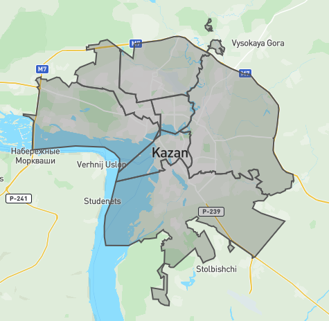
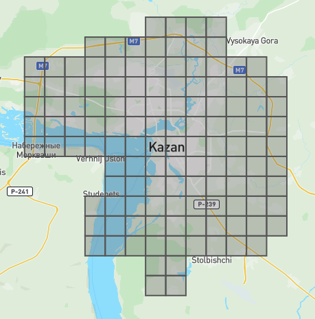

# Парсер предложений с сайта ЦИАН

Предложения фильтруются по geojson фигуре и фильтрам [ЦИАН](https://cian.ru). Теоретически, лимита по выгрузке нет

Проект не предназначен для автоматизированного использования, только для сбора данных для проведения аналитики по этим данных

- Пример использования: [example.py](./example.py)
- Пример данных: [offers.json](./offers.json)

## Особенности фильтрации по геометрии

Переданная фигура бьется на множество прямоугольных областей, с размером грани не более значения в метрах, указанного в аргументе `max_tile_size`. Поэтому собираются также "лишние" предложения

### Пример

**Оригинальная фигура**



**Области поиска**



## Ускорение поиска

Поиск можно ускорить регулируя размер тайлов (параметр `max_tile_size`) и количество параллельных воркеров (параметры `max_workers_collect_ids` и `max_workers_collect_offers`)

## В случае появления капчи

Нужно открыть сайт ЦИАН в браузере, пройти капчу а затем скопировать Cookie из браузера в файл `cookie.txt`

### Пример

```
__cf_bm=rfpZkUSsR3PSEsEP6aRZd7C44wg_RGUG_fIUP2WIVN8-1701706774-0-ARq9T3PzfeD6qHRBRXusFoY2nrRRio1VoIPr8zdr6hmLti+Bfut2OslAdMR1sydY7LRT06udCC4fvCk56tQnsEY=; _CIAN_GK=9394f3f9-8a7f-4d95-b523-80e32f97ac0c; _gcl_au=1.1.83902058.1701706775; tmr_lvid=f697472ee12d15e664b4c2b485e0fb57; tmr_lvidTS=1701706775249; anti_bot="2|1:0|10:1701706794|8:anti_bot|44:eyJyZW1vdGVfaXAiOiAiMTc4LjE0MC4yMzIuMTkyIn0=|81b9b12431906e7b127cb6bbadae61ac603733791e046167fc3a2b5fe30dead7"; session_region_id=1; login_mro_popup=1; sopr_utm=%7B%22utm_source%22%3A+%22direct%22%2C+%22utm_medium%22%3A+%22None%22%7D; sopr_session=88b12aa68f474940; uxfb_usertype=searcher; _ym_uid=1701706796221585346; _ym_d=1701706796; _ym_isad=1; _gid=GA1.2.1725231805.1701706796; _dc_gtm_UA-30374201-1=1; uxs_uid=f658b990-92c0-11ee-8bd5-97f21ed29bac; _ym_visorc=b; afUserId=025a4dfc-6691-4de0-9e35-076e493dd2a7-p; AF_SYNC=1701706796490; viewpageTimer=24.131; session_main_town_region_id=1; _ga_3369S417EL=GS1.1.1701706794.1.1.1701706803.51.0.0; _ga=GA1.2.2022810257.1701706795
```

