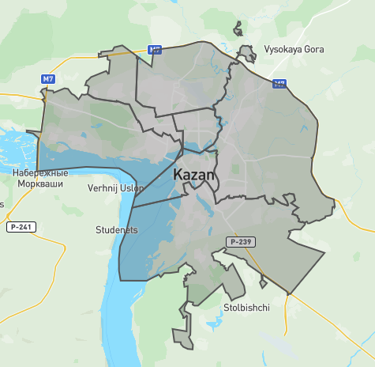
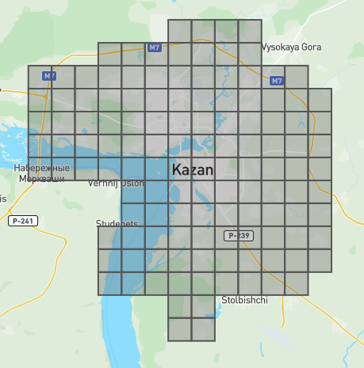
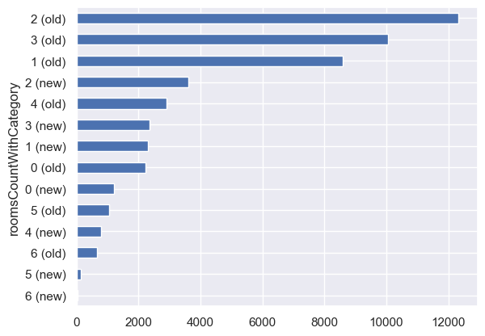
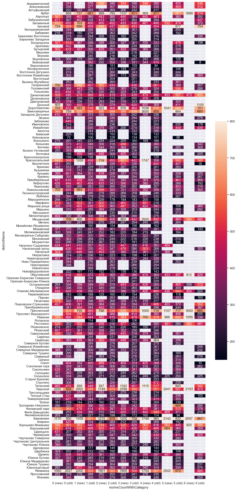

# Парсер предложений с сайта ЦИАН

Предложения фильтруются по geojson фигуре и фильтрам [ЦИАН](https://cian.ru). Теоретически, лимита по выгрузке нет

## Особенности фильтрации по геометрии

Переданная фигура бьется на множество прямоугольных областей, с размером грани не более значения в метрах, указанного в аргументе `max_tile_size`. Поэтому собираются также "лишние" предложения

### Пример

**Оригинальная фигура**

**Области поиска**

## Ускорение поиска

Поиск можно ускорить регулируя размер тайлов (параметр `max_tile_size`) и количество параллельных воркеров (параметры `max_workers_collect_ids` и `max_workers_collect_offers`)

## Примеры анализа данных

### Количество квартир по комнатности в Москве на 3 декабря 2023 (кол-во)

### Медианная стоимость за кв. метр по районам Москвы на 3 декабря 2023 (тыс. руб)

