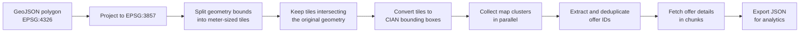

<div align="center">

# cianparser

### Geo-aware CIAN listing collector for real-estate analytics

[](#)
[](#geospatial-search)
[](#architecture)

Collect real-estate offers from CIAN by combining frontend-compatible search filters with GeoJSON-based spatial filtering. Built for one-off analytical datasets, market research, and geospatial experiments.

</div>

---

## Why this project

Most real-estate scraping examples start from pages and pagination. This project takes a more scalable geospatial approach:

1. Accept a custom GeoJSON polygon.
2. Convert it into bounded CIAN map search boxes.
3. Collect offer IDs from map clusters.
4. Deduplicate IDs across overlapping tiles.
5. Hydrate raw offer payloads in parallel.
6. Export structured JSON for downstream analytics.

The result is a compact, end-to-end data pipeline that demonstrates API reverse-engineering, geospatial decomposition, bounded concurrency, failure handling, and analytics-oriented output design.

> This project is intended for research and analytical data collection, not for high-volume automated use.

## What it does

* **GeoJSON search area** — accepts arbitrary geometry in `EPSG:4326`.
* **Tile-based spatial decomposition** — splits a search area into CIAN-compatible bounding boxes.
* **CIAN filter compatibility** — accepts a `jsonQuery` object similar to the one sent by the CIAN frontend.
* **Parallel collection** — uses separate worker pools for offer ID discovery and offer hydration.
* **Deduplication** — removes repeated offer IDs caused by overlapping or adjacent map tiles.
* **Raw export** — writes offer payloads as JSON so analysis code can evolve independently from collection code.

## Repository layout

```text
.
├── cian/
│   ├── geo.py          # GeoJSON -> projected geometry -> CIAN bounding boxes
│   ├── helpers.py      # Small collection helpers: chunks, split, flatten
│   └── parser.py       # CIAN API orchestration and concurrent collection
├── images/             # README diagrams and example analytics charts
├── example.py          # End-to-end runnable example
├── kazan.geojson       # Example search polygon
├── moscow.geojson      # Example search polygon
└── offers.json         # Example output dataset
```

## Architecture


```mermaid
flowchart LR
    A[GeoJSON polygon<br/>EPSG:4326] --> B[Project to EPSG:3857]
    B --> C[Split geometry bounds<br/>into meter-sized tiles]
    C --> D[Keep tiles intersecting<br/>the original geometry]
    D --> E[Convert tiles to<br/>CIAN bounding boxes]
    E --> F[Collect map clusters<br/>in parallel]
    F --> G[Extract and deduplicate<br/>offer IDs]
    G --> H[Fetch offer details<br/>in chunks]
    H --> I[Export JSON<br/>for analytics]
```

### Core components

| Component                                | Responsibility                                                                     |
| ---------------------------------------- | ---------------------------------------------------------------------------------- |
| `cian.geo.get_cian_bboxes_for_geojson()` | Converts GeoJSON geometry into CIAN-compatible map bounding boxes.                 |
| `cian.parser.Parser.get_offer_ids()`     | Calls the map-cluster endpoint, extracts `clusterOfferIds`, and deduplicates them. |
| `cian.parser.Parser.get_offers_by_ids()` | Splits IDs into chunks and fetches full serialized offer payloads.                 |
| `cian.parser.Parser.parse()`             | Runs the full collection pipeline and returns a list of offers.                    |

## Geospatial search

The parser uses a pragmatic approximation: it covers the input polygon with rectangular tiles, then sends each tile to the CIAN map endpoint.

<div align="center">

| Original geometry                                                                       | Search tiles                                                                                |
| --------------------------------------------------------------------------------------- | ------------------------------------------------------------------------------------------- |
|  |  |

</div>

### Important trade-off

Because CIAN accepts rectangular map bounds, some offers outside the original polygon may be collected when they fall inside an intersecting tile. This is intentional: the collector favors recall during data collection, then lets downstream analytics apply stricter geometry filtering when needed.

Tune this behavior with `max_tile_size`:

|         Value | Effect                                                               |
| ------------: | -------------------------------------------------------------------- |
| Smaller tiles | More precise geometry coverage, more requests.                       |
|  Larger tiles | Fewer requests, faster discovery, more extra offers near boundaries. |

## Quick start

### 1. Clone the repository

```bash
git clone https://github.com/mishannn/cianparser.git
cd cianparser
```

### 2. Install runtime dependencies

This repository is intentionally lightweight and is not packaged yet. Install the libraries used by the parser directly:

```bash
pip install requests shapely pyproj
```

### 3. Run the example

```bash
python example.py
```

The example reads `kazan.geojson`, collects offers using the provided CIAN filter object, and writes the result to `offers.json`.

## Minimal usage

```python
import json
import logging

from cian.parser import Parser

logging.getLogger().setLevel(logging.INFO)

with open("kazan.geojson", encoding="utf-8") as f:
    geojson = f.read()

query = {
    "_type": "flatsale",
    "engine_version": {"type": "term", "value": 2},
    "room": {"type": "terms", "value": [3]},
    "with_newobject": {"type": "term", "value": True},
}

parser = Parser(
    geojson=geojson,
    query=query,
    max_tile_size=5_000,
    max_workers_collect_ids=1,
    max_workers_collect_offers=10,
    headers={},
)

offers = parser.parse()

with open("offers.json", "w", encoding="utf-8") as f:
    json.dump(offers, f, ensure_ascii=False, indent=2)
```

## Configuration reference

| Parameter                    |   Type | Description                                                                    |
| ---------------------------- | -----: | ------------------------------------------------------------------------------ |
| `geojson`                    |  `str` | GeoJSON geometry in `EPSG:4326`.                                               |
| `query`                      | `dict` | CIAN `jsonQuery` filter object. Mirrors the structure used by CIAN’s frontend. |
| `max_tile_size`              |  `int` | Maximum tile edge length in meters after projection to `EPSG:3857`.            |
| `max_workers_collect_ids`    |  `int` | Worker count for collecting offer IDs from map clusters. Keep conservative.    |
| `max_workers_collect_offers` |  `int` | Worker count for fetching full offer payloads by ID.                           |
| `headers`                    | `dict` | Optional request headers. Leave empty for normal analytical runs.              |

## Example analysis

The repository includes example charts built from collected Moscow offer data.

<div align="center">

### Apartments by room count


### Median price per square meter by Moscow district


</div>

## Engineering highlights

This project is intentionally small, but it contains several design decisions that matter in production-grade data systems:

* **Spatial decomposition over pagination** — treats the map as the primary discovery surface instead of relying on result pages.
* **Projection-aware tiling** — converts WGS84 geometry to a metric projection before splitting by meter-sized tiles.
* **Two-stage collection** — separates ID discovery from payload hydration, making deduplication and retry strategies easier to evolve.
* **Bounded parallelism** — exposes worker counts as configuration instead of hard-coding aggressive concurrency.
* **Fail-fast errors** — wraps unsuccessful or non-JSON responses in a domain-specific `CianError`.
* **Analytics-first output** — keeps raw offer objects available for notebooks, dashboards, and reproducible analysis.

## Operational notes

* API responses may change because the project relies on endpoints used by the CIAN web experience.
* Search tiles can return extra offers outside the original polygon; apply a final geometry filter in analysis code if strict boundaries matter.
* Use conservative worker counts. This project is for research datasets, not continuous crawling.
* The parser does not automate CAPTCHA solving or access-control bypasses. If the website presents an access challenge, pause the run and operate within the site’s terms and applicable law.
